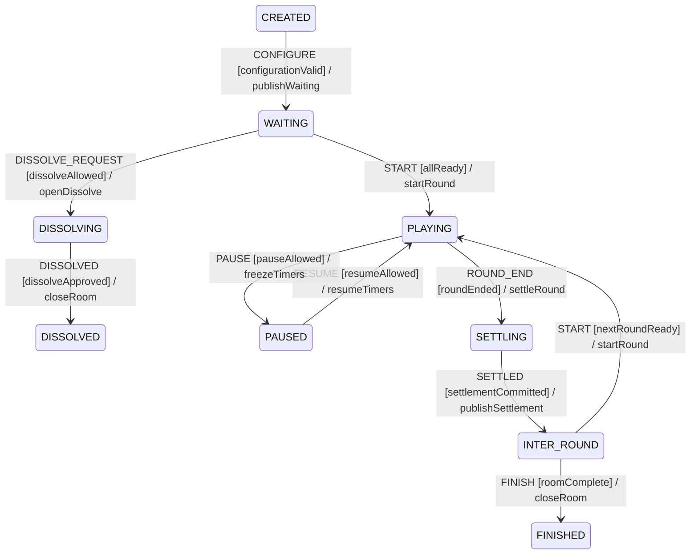

# Aoo 通用房间状态机

```mermaid
stateDiagram-v2
    CREATED --> WAITING : CONFIGURE [configurationValid] / publishWaiting
    DISSOLVING --> DISSOLVED : DISSOLVED [dissolveApproved] / closeRoom
    INTER_ROUND --> FINISHED : FINISH [roomComplete] / closeRoom
    INTER_ROUND --> PLAYING : START [nextRoundReady] / startRound
    PAUSED --> PLAYING : RESUME [resumeAllowed] / resumeTimers
    PLAYING --> PAUSED : PAUSE [pauseAllowed] / freezeTimers
    PLAYING --> SETTLING : ROUND_END [roundEnded] / settleRound
    SETTLING --> INTER_ROUND : SETTLED [settlementCommitted] / publishSettlement
    WAITING --> DISSOLVING : DISSOLVE_REQUEST [dissolveAllowed] / openDissolve
    WAITING --> PLAYING : START [allReady] / startRound
```
