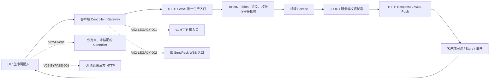

# V02｜全接口端到端可达性机器终审

审计日期：2026-08-24  
当前结论：**FAIL（4 个唯一断链 ID；只有 0 个断链才允许 PASS）**

## 1. 边界与判定

- 审计当前树：`/Users/aoo/Code/Game/BCG/Aoo`；旧版 `/Users/aoo/Code/Game/BCG/Test` 本轮未写入。
- 本轮只新增只读源码审计门禁、门禁测试和本报告，未修改生产源码。
- 自动检查覆盖 `Client/assets`、`Admin/src` 与 `Server/server` 的生产源码；排除 `target`、`node_modules` 和 `src/test`。
- 人工、浏览器、Cocos 编辑器和真实设备验收按任务要求暂缓，不计作自动 PASS 证据。
- 接口类、路由类或测试单独存在不算闭环。机器门禁必须同时满足：无旧 HTTP 入口、无旧 `SendPack`、客户端 HTTP 路径有服务端生产路由、无 UI 直连外部服务旁路、无只定义未装配的网络控制器。

## 2. UI → 权威状态 → UI 可达图



实线是唯一可接受的生产闭环。虚线均为当前机器扫描实际命中的断链或旁路，所以本轮不得把 V02 标为通过。

## 3. 机器清点结果

| 项目 | 数量/结果 |
|---|---:|
| 客户端/Admin 生产源码文件 | 635 |
| 服务端生产 Java 文件 | 3711 |
| 客户端 HTTP 路径字面量 | 71 |
| 服务端版本化 HTTP 路径/前缀 | 141 |
| 客户端路径可匹配服务端生产路径 | PASS |
| 无 v1 旧 HTTP 入口 | FAIL |
| 无旧 `SendPack` 入口 | FAIL |
| 无 UI 直连外部 HTTP 旁路 | FAIL |
| 无只定义未装配网络适配器 | PASS |
| 断链 ID 唯一 | PASS |

“客户端路径可匹配服务端生产路径”只证明传输路由静态存在，不能抵消同一路径仍走 v1、UI 未装配或绕过权威服务的失败。

## 4. 唯一断链台账

| ID | 断点 | 责任边界 | 代表性机器证据 | 关闭条件 |
|---|---|---|---|---|
| `V02-LEGACY-001` | 生产客户端仍直接调用 `/v1/*` 或 `/api/v1/*`，唯一 v2 HTTP 入口不成立 | Client/Admin network owner → API governance owner | `RankingGateway.ts:4`、`IdentityVerificationClient.ts:10`、`ActivityGateway.ts:7`、`LegacyHttpAuthGateway.ts:17`、`AooWeChatBindingController.ts:3`；门禁实际记录前 40 个命中 | 所有生产调用迁至唯一现行契约，旧入口从生产入口不可达，扫描为 0 |
| `V02-LEGACY-002` | 正式 `Client/assets` 仍存在可达 `SendPack(...)`，旧 WSS 协议未关闭 | Client realtime owner → Gateway owner | `LegacyAqmjRoomManager.ts:374`、`LegacyBdjhmjRoomManager.ts:401`、`LegacyBamjRoomManager.ts:370`；门禁实际记录前 40 个命中 | UI/玩法全部改接权威协议，发布 assets 中 `SendPack(` 为 0，Gateway 旧入口拒绝 |
| `V02-BYPASS-001` | Admin UI 直接请求外部高德 HTTP，绕过服务端鉴权、审计和集成权威边界 | Admin/Client owner → Server integration owner | `Admin/src/utils/request.ts:167` | UI 只调用 Aoo 服务端受控接口；第三方密钥、限流、审计和错误映射由服务端承担；直连扫描为 0 |
| `V02-UI-001` | 已关闭（2026-08-24） | UI scene/controller owner → Client API owner | `RoomNetworkControllerMount` 由 `LegacyLobbyScreen` 生产实例化；消费 NJPDK/通用入房事件，装配 `RoomController`、`RoomReconnectController`、`RoomVoiceController`，并回流网络、权威状态、动作和语音状态 | 门禁 `noUninstantiatedNetworkAdapters=true`，孤立适配器为 0 |

责任边界用于派单，不授权本审计任务跨边界修改生产实现。每个断点只有一个机器稳定 ID；门禁会同时检查 ID 去重和非空责任边界。

## 5. 门禁与复现

```bash
cd /Users/aoo/Code/Game/BCG/Aoo
ruby Server/tools/audit_v02_interface_reachability.rb
ruby Server/tools/test/audit_v02_interface_reachability_test.rb
```

2026-08-24 整改后实跑结果：

- 审计门禁：退出码 `1`，`result=FAIL`；`V02-UI-001` 已消失，剩余断链仅为边界外
  `V02-LEGACY-001`、`V02-LEGACY-002`、`V02-BYPASS-001`。
- 检查项：`noUninstantiatedNetworkAdapters=true`、`allClientHttpPathsHaveServerContext=true`。
- 门禁测试：`3 runs, 18 assertions, 0 failures, 0 errors, 0 skips`。
- 大厅 UI 自动化：`6/6` 通过；公共房间/重连控制器：`5/5` 通过；语音控制器：`3/3` 通过；
  Client TypeScript 全量检查 0 诊断。
- 门禁通过条件写死为 `findings.empty? && uniqueFindingIds`；不能靠修改报告文字升级状态。

## 6. 暂缓项与最终关闭条件

人工/真实设备验收继续暂缓：Cocos 场景实际点击、移动端权限、真实 TLS/WSS、微信/支付/对象存储、多人房间与弱网重连均未执行。它们不得被当前静态门禁替代，也不得在本报告标记通过。

V02 最终关闭必须在同一最新代码快照重新运行门禁并得到：`result=PASS`、退出码 `0`、断链数 `0`，随后再由统一验收任务补齐暂缓的真实环境证据。当前状态保持 **待统一稽核 / FAIL**。
