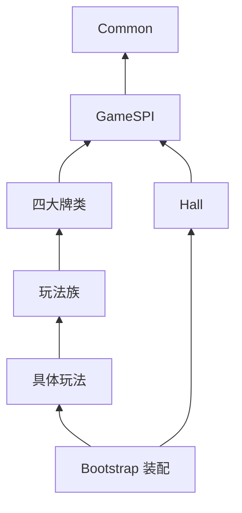

# Aoo 棋牌后端架构开发规范

> 权威范围：登录、大厅、亲友圈、房间、四大牌类、全部玩法、管理后台、数据、安全、发布和运维。  
> 核心目标：负责人通过管理后台配置已有玩法，不接触代码；服务端是牌局、权限和得分的唯一权威。  
> 当前基线（2026-08-23）：编译目标 Java 25 LTS（`--release 25`）；构建、测试和运行验证使用 Oracle JDK `26.0.2.1`；Maven Wrapper `3.3.4` / Maven `3.9.16`。实际完成状态以升级台账为准。

---

## 1. 负责人先看

### 1.1 五层结构

```text
Common 公共平台
→ Mahjong / Poker / LongCard / WordCard 四大牌类
→ XueZhan / TuiDaoHu / PaoDeKuai 等玩法族
→ ChengDuXueZhan / NeiJiangPaoDeKuai 等具体玩法
→ 房间绑定的不可变发布版本
```

- `Common`：账号、房间、亲友圈、聊天、重连、托管、账务、战绩、回放等全局能力。
- 牌类层：该牌类真正公共的牌、操作、流程、重连和结算基础。
- 玩法族：复用高度相似的流程，不代表地区。
- 具体玩法：只保存全国或地区独有差异。
- 发布版本：房间创建后固定，后台修改只影响新房间。

### 1.2 无代码新增玩法

```text
复制相近模板
→ 选择牌类、玩法族、全国/省/市
→ 配置房间、玩法、流程、算分、结算、UI、聊天
→ 自动校验与牌例
→ 灰度发布
```

只有出现全新操作、状态、牌型算法、算分算法或协议字段时，开发人员才新增最小组件；注册后继续由后台复用。

### 1.3 强制原则

- 服务端权威，客户端只提交意图和渲染结果。
- 人看总表是后台聚合视图，机器按职责分表，二者同源实时一致。
- 已发布版本不可覆盖，只能发布新版本、停用或回滚引用。
- 同一房间顺序执行，不同房间并行；扣费、结算、奖励全链路幂等。
- 功能和故障修复必须进入权威领域模型、状态机或统一基础设施入口，禁止用额外条件分支、重复状态、补偿轮询、临时开关、兼容转发或旁路写入持续包裹旧逻辑。确认同一根因已形成多层补丁时，必须先冻结继续叠加，建立行为与数据基线，再将相关流程收敛为单一权威实现。

补丁堆叠以调用链和状态模型证据判定，不以代码行数、历史提交数或 `fix/legacy` 名称机械判断。典型证据包括：同一业务规则在多个 Handler/Service/Consumer 重复修正；同一状态同时存在数据库、Redis、房间内存和布尔标记的非权威双写；成功路径依赖异常补偿；新补丁显式识别旧补丁；多个重试、定时器或 MQ 消费者竞争推进；临时开关、兼容路由和双写没有退出条件。

需要重构时必须围绕领域状态机、不可变事件/流水、唯一事务边界、幂等命令和统一错误语义重新建立主流程，迁移全部生产入口后删除旁路。外部协议和历史数据兼容只能集中在边界适配器中只读转换，并具备版本、使用方、监控、截止时间和移除条件；禁止把内部错误模型永久暴露为兼容契约。

业务主流程一旦确认依赖补丁链，该流程必须强制重写，不得以“风险较小”为由继续局部修补。涉及账务、结算、房间状态、随机发牌、身份权限、安全或核心服务可用性的补丁链属于上线阻断项；只有新权威流程独立闭环、全部生产入口完成切换、旧链从构建/注册/路由/配置中删除或被机器证明不可达后才能发布。

重构前必须固化正常、异常、并发、恢复、账务和历史兼容行为测试；重构中按可回滚阶段迁移，禁止未经证明的大爆炸替换；完成后必须证明新主流程不依赖旧分支、没有双写和重复副作用，并通过故障注入、数据对账、性能及真实全链路验证。仅拆分类、增加接口/Facade、移动 Helper 或用新入口继续调用旧补丁链，不得宣称完成重构。

旧业务、旧补丁或过渡方案下线必须同时清除源码定义、实例/单例、调用与继承、依赖注入、注解/SPI/反射、Controller/Handler/Router、协议/Msg、MQ 消费者、定时/补偿任务、配置键/开关、当前数据引用、测试/mock 以及构建/部署/发布入口。用于过渡测试的临时模块、脚本、配置、账号、房间、数据、mock、日志和构建产物必须在验证后清理；需长期保留的测试必须收敛为正式回归测试。只删主类或只使路径不可达不算完成；必须通过双向引用扫描、依赖图、启动装配、真实中间件联调和全链路回归证明零残留。历史迁移、已发布协议/回放、审计数据和仍在兼容期的只读适配必须按保留清单管理，禁止误删。

开发过程遗留的旧入口必须独立审计，包括旧 Main/Bootstrap、Controller/Handler/Router、内部调试 HTTP/RPC、旧协议/Msg/错误码别名、测试快捷登录/创房/加分/控牌入口、旧 SPI/反射/注解/依赖注入、旧 MQ Topic/消费组、旧定时/补偿任务、旧数据写入脚本、旧 Maven/Ant/CLI/运维启动命令、旧 profile/配置键/开关/服务发现名和管理后台隐藏菜单。即使只在 dev/test profile、特定参数、内网或默认关闭开关下可达，也必须登记所有者、用途、鉴权、环境隔离、流量、回归测试和删除期限；无完整证据的一律按开发遗留清退。

服务端干净验收必须达到：每项能力只有一个现行权威入口和实现；无旧路由/注册/消费者/任务/数据写路径、无备用旧链、无重复实现、死代码、孤儿配置、临时开关、调试凭证、注释掉的旧代码、无期限兼容、无效分支/参数/转发层、无所有者 TODO/FIXME/HACK 和无治理日志。保留的正式开发工具必须物理与生产构建隔离，且具有强鉴权、审计和自动化生产不可达门禁。
- 不使用假数据替代真实数据库、中间件或游戏服务。

所有现行流程必须以真实入口、真实协议、真实 Gateway/路由、真实领域状态机、真实数据库/缓存/MQ/第三方依赖、真实事务/账本副作用和真实客户端回写完成全链路验收。正常、异常、并发、重试、断线、迟到 Msg、节点重启/接管、配置变更、回滚和终态清理都必须有证据；单元测试、mock 或直接调内部 Handler 不得代替。

每条流程验收前必须证明旧协议/Msg、旧 Gateway/路由/Handler、旧 SPI/注入/反射注册、旧 MQ 生产者/消费者/Topic、旧定时/补偿任务、旧表/缓存写路径、旧配置/开关/服务发现和旧构建/部署入口均已删除，或仅保留在有版本、调用方、流量监控、截止时间和负责人的集中只读兼容边界。必须通过双向扫描零残留、启动/注册零旧入口、E2E 只命中新链路和观察窗口旧链路流量为零四类证据验收。

任一现行流程未全链路验收、任一必测分支无证据或任一非允许旧链路仍有注册/流量/写入，都必须阻断对应服务发布。

---

## 2. 模块、SPI 与依赖方向

当前物理构建权威为根 Maven Reactor 声明的 `43` 个子模块（连同根工程共 `44` 个 Reactor projects）；概念职责与物理模块的自动对账、非 Reactor Maven 工程及 Ant 遗留入口清册见 `docs/generated/drift01-module-reconciliation.json`。非 Reactor 工程只作隔离对照，不属于生产依赖图。

### 2.1 目标模块

```text
Server/
├── Common
├── GameSPI
├── Mahjong
├── Poker
├── LongCard
├── WordCard
├── Families
├── Games
├── Hall
├── Club
├── ConfigCenter
├── Admin
├── Gateway
├── RiskControl
├── Operations
└── Bootstrap
```

### 2.2 正确依赖



- SPI 独立于大厅；大厅只依赖 SPI，子游戏实现 SPI 但不依赖大厅。
- `Bootstrap` 是唯一装配入口，负责加载大厅和具体玩法。
- 四大牌类不得互相依赖，具体玩法不得依赖其他具体玩法。
- Maven Enforcer、ArchUnit 和包依赖测试强制边界，不能只靠文档。

必须按现行 Reactor/部署服务、业务域、每个 `game_code` 和每项功能建立全量清册，逐项审计 Maven 依赖、Java 包/调用、SPI/反射/注解装配、Controller/Handler/Router、Msg/事件、MQ Topic、定时任务、共享表/缓存、配置键、管理后台和部署拓扑。只有 Maven 无循环不代表运行时、数据或消息已解耦。

每个功能必须具有单一业务所有者、唯一权威状态、稳定契约、独立生命周期和可单独测试的边界。禁止具体玩法直接依赖另一玩法，多模块跨边界写对方表/缓存，通过全局单例、字符串路由、共享可变对象或复制代码隐藏依赖。真实公共能力必须上移到玩法族、牌类、GameSPI 或正确领域服务，差异使用版本化配置或 SPI/策略表达。

确认可解耦且净收益明确的依赖必须进入整改清单，迁移完所有生产入口并删除旧直连后才能验收。但禁止一对一空接口、Facade/Manager/Helper 转发链、无语义事件化和分布式单体式“假解耦”；无跨边界风险的简单同模块调用应明确判定为合理直接依赖。

### 2.3 核心扩展契约

- `GameProvider/GameDescriptor`：注册玩法及能力版本。
- `GameRoomFactory`：根据已编译版本创建房间。
- `RoomLifecycleExtension`：创建、开始、局结束、解散、恢复。
- `RuleComponent/RuleResult`：规则执行与明确结果。
- `ReconnectViewProvider`：按查看者生成重连数据。
- `SettlementExtension`：牌类和玩法结算扩展。
- `GameProtocolHandler`：协议入口，不直接暴露内部房间对象。

重复编号、注册冲突、缺少组件或版本不兼容时服务必须快速失败，不得静默使用默认实现。

### 2.4 服务职责

| 模块 | 责任 | 禁止 |
|---|---|---|
| Hall | 导航、玩法目录、服务协调 | 直接依赖具体子游戏 |
| Club | 成员、权限、模板、亲友圈房间归属 | 直接改余额或牌局状态 |
| Room | 生命周期、座位、状态机 | 处理亲友圈组织管理 |
| Billing | 房卡、扣退、奖励、流水、对账 | 无流水直接改余额 |
| ConfigCenter | 草稿、校验、发布、版本、通知 | 热改进行中房间 |

---

## 3. 公共能力与玩法结构

`Common` 内部分为 Network、Identity、Player、Room、Club、Chat、Reconnect、Trustee、Progress、Settlement、Replay、Billing、Storage、Security、Monitoring。

公共房间包含创建、进入、退出、解散、座位、观战、网络状态、托管、文字聊天、可选表情套装、玩法快捷文字语音、战绩和回放基础。吃碰杠胡和牌型比较属于牌类层。

快捷文字由权威房间会话处理 `common.room.dispatch/quick_text`：校验玩家会话与房间成员身份后形成权威房间事件，再由 Gateway 房间广播枢纽投递给有权接收的房间客户端。客户端本地发送成功不等于消息送达，不得绕过服务端广播自行伪造跨客户端展示。

四类命名永久固定：

- `Mahjong`：牌墙、摸打、吃碰杠胡过、庄家、胡牌与番型接口。
- `Poker`：牌库、轮次、过牌、牌型识别和比较、炸弹。
- `LongCard/WordCard`：各自公共牌数据、操作、流程、判定和结算。

具体玩法只保存注册、独有规则、流程、算分、协议扩展、默认配置、校验和特殊结算字段，不复制公共房间或牌类代码。

---

## 4. 配置、全国玩法与房间规则

机器配置分为：玩法目录、牌类、玩法族、地区、继承、房间方案、房间字段、进度、玩法规则、流程规则、算分规则、结算、UI、Prefab/Bundle、协议、服务端、亲友圈、聊天和发布版本。

基础必备规则由系统锁定，不重复配置；“默认但不显示”由服务端启用，不能只在 Cocos 隐藏。

### 4.1 全国玩法

全国玩法只配置一次，`regionScope=NATIONAL`，不复制到每个省市。服务端返回：

```text
全部可用 NATIONAL
+ 当前 PROVINCE
+ 当前 CITY
→ 渠道、亲友圈、版本、灰度过滤
→ CITY > PROVINCE > NATIONAL 合法覆盖
→ 按 gameId + version 去重排序
```

Cocos 不写死全国玩法，只展示服务端最终目录；资源缺失时下载对应 `uiProfile/bundleIds` 后才能进入。发布前随机验证多个省市均能显示。

### 4.2 房间进度

- 按局、按圈、按时间。
- 按圈默认每名玩家完成一次庄家为一圈，可由牌类组件定义。
- 按局和时间支持全房统一进度或玩家坐下后独立进度。
- 必须定义中途加入、离座、掉线、托管、旁观转玩家、提前解散和跨时最后一局。

---

## 5. 规则组件契约

组件类型固定为 RoomRules、PlayRules、FlowRules、ScoreRules、SettlementRules、ExtensionRules。

每个组件登记 `ruleId`、`componentVersion`、牌类、玩法族、阶段、优先级、参数、依赖、互斥、协议/资源版本、性能预算、失败级别和允许读写范围。

禁止把完整可变 `Room` 交给所有组件。使用阶段接口：

```text
RoomReadView
PlayerHandReadView
FlowMutation
ScoreAccumulator
SettlementReadView
```

算分组件只能写 `ScoreAccumulator`；结算展示只能读取结果。发布时编译有序执行链并缓存，运行时禁止查询配置、解析 JSON、反射找组件或重新排序。

权威组件异常时房间进入 `SUSPENDED`：停止操作、保存快照、通知玩家并自动恢复或人工处理；禁止跳过算分/流程组件继续游戏。

### 5.1 每一小局独立随机发牌

所有麻将、扑克、长牌、字牌及后续新增游戏，每一小局开始时都必须由服务端重新构造该玩法和规则版本对应的完整初始牌库，并使用本小局独立的密码学安全随机种子完成无偏洗牌。禁止沿用上一小局剩余牌序、复用随机生成器状态、固定种子、只用时间戳/房间号/玩家 ID 等可预测值播种，也禁止客户端、机器人、房主、亲友圈、运营后台或外部请求提供/覆盖种子和牌序。

标准洗牌必须使用经过审查的无偏算法（例如正确实现的 Fisher–Yates）和无取模偏差的随机取样；不得以多次普通 `shuffle`、随机交换若干次、排序比较器返回随机数或截断随机值冒充均匀洗牌。随机源和洗牌实现属于公共牌类基础能力，具体玩法只能声明牌库组成、合法移除/保留牌和规则规定的发牌顺序，不能复制或替换安全随机实现。

“随机发牌”不取消玩法规则。庄家先发、底牌/留牌、翻牌、补牌、切牌、癞子产生、发牌张数和明暗牌规则可以按版本化规则作用于已随机化牌序；任何定向牌、神牌、单控、胜率控制、按玩家身份/付费/输赢历史调牌、机器人让牌和大数据控牌均禁止进入生产。开发测试所需固定牌例只能通过编译/部署隔离的测试接口启用，生产构建必须不存在可达入口，并由机器门禁验证。

每一小局必须生成唯一 `roundId`、随机源版本和种子承诺/摘要，并在发牌前原子绑定房间实例、局号、规则版本、完整牌库摘要与事件序号。原始种子和完整牌序属于隐藏信息，只保存于加密、严格授权的权威状态/争议审计存储，不得提前下发客户端、写普通日志或暴露后台；小局结束后按审计策略允许服务端验证“承诺、牌库、操作事件和最终公开结果”一致。

断线重连、暂停恢复和节点接管必须恢复同一小局已经确定的随机状态和剩余牌序，绝不能重新洗牌；只有进入新的 `roundId` 才重新生成独立随机种子和牌库。重复开始 Msg、幂等重试或主从切换必须返回同一小局结果，不能额外消耗随机数或生成第二副权威牌序。

审计必须逐个现行 `game_code` 追踪牌库构造、随机源注入、洗牌、发牌、补牌、留牌、恢复、回放和测试控牌入口。自动测试至少包含：牌数/牌值守恒、无重复无丢牌、同种子可重放、不同小局种子与牌序不复用、并发房间随机状态隔离、重试/重连/接管不重洗，以及针对首牌、座位、牌值和组合分布的统计检验。统计检验只能发现明显偏差，不能单独证明随机安全；必须同时通过源码边界、随机源、生产入口不可达和事件审计验证。

任一游戏无法证明每一小局独立安全洗牌，或仍存在生产可达的定向发牌/控牌入口，均属于上线阻断项。监控不得记录暗牌，但应统计随机源初始化失败、种子/`roundId` 重复、牌库守恒失败、承诺校验失败和生产测试入口探测，任一命中立即冻结该房间并告警。

---

## 6. 运行时、一致性与高可用

### 6.1 状态机与异常

统一房间状态：`CREATED→WAITING→PLAYING→SUSPENDED/SETTLING→FINISHED/DISSOLVED`。局内状态由牌类扩展，所有转换经状态机校验。

托管 AI 只能提交普通玩家操作意图，不能直接改状态。全局错误包含稳定错误码、玩家安全提示、内部原因、是否可重试和 `traceId`；内部堆栈不得下发客户端。

每个状态必须明确合法入边、出边、唯一推进所有者、最大驻留时间和超时后的唯一终态/人工接管去向。禁止无出边的非终态、A→B→A 无界循环、多个定时器/消费者竞争推进和依赖重启服务才能清除的内存状态。

所有循环、递归、重试、轮询、MQ 重投、Saga 补偿和定时调度必须有可证明的单调收敛量、最大次数/深度/总时长、幂等键、熔断、死信或人工工单去向；跨服务链路必须核算总重试上限，不得因每层各自重试形成乘法放大或无限往返。

上线前必须对空值、越界/溢出、时间与精度、非幂等、并发竞态/死锁、事务部分成功、缓存/数据库/房间内存不一致、迟到/重复 Msg、节点接管和配置变更进行属性测试、并发测试、故障注入和耐久测试。任一生产可达的无界执行、无限重试/重投、永久非终态、忙等、死锁或重复账务副作用都属于上线阻断项。

### 6.2 最终一致性

```text
本地事务写业务数据 + Outbox
→ RocketMQ
→ eventId 幂等消费
→ 有限重试/死信
→ Saga 补偿
→ 自动对账与人工工单
```

禁止在数据库事务内调用外部 HTTP。余额、扣费、退款、奖励和结算使用不可变流水及唯一业务号。

### 6.2.1 用户设置权威与同步

用户主动设置必须有统一目录，明确 key、账号归属、生效范围、数据级别、类型/范围、默认值、持久化表/字段、协议/Msg、版本、修改时间、乐观锁和删除策略。需要跨设备、重装恢复或影响业务、权限、隐私和安全的设置必须持久化于服务端权威存储；Redis 和客户端副本仅是可失效缓存，不能成为唯一记录。

设置写入必须鉴权授权、校验 key/类型/范围、使用幂等 operationId 或乐观版本，并返回服务端最终值与新版本。多设备、离线队列、迟到/重复 Msg 和管理端修改必须有显式冲突规则，禁止无版本最后写入盲目覆盖。客户端退出、设备撤销和账号销毁时，服务端必须返回需清理的本地 key/凭证指令，并按数据保留规则处理服务端记录。

### 6.3 房间恢复

租约和 fencing token 保证单一写节点。周期快照保存玩法/组件版本、随机状态、牌库、座位、流程、计时器和事件序号；连续事件进入可靠存储。

节点故障后新节点取得更高 token，加载快照、重放事件、校验摘要、恢复计时器并允许重连。旧 token 写入必须被拒绝；无法证明一致时保持冻结。

首期采用同城多可用区和跨地域备份/灾备，不直接实施高风险跨地域房间双活。明确快照介质、频率、保留期、调度器和单可用区故障容量。

### 6.4 玩家房间会话权威与旧桌循环防护

服务端维护唯一权威的“玩家 → 活动席位 → 房间实例 → 当前路由”关系。每条活动关系至少包含 `userId`、`roomId`、`roomInstanceId`、席位状态与 `membershipVersion`、节点/分片与 `routeVersion`、fencing token、房间生命周期、连接代次、过期时间和更新时间；数据库或等价权威存储必须保证同一玩家同一时刻至多一条有效活动席位。Redis、本地缓存和客户端缓存只能加速读取，不能成为权威来源。

统一恢复接口必须在同一一致性边界内交叉校验活动关系、房间实例、席位和房间生命周期，返回明确的“允许恢复、无活动房间、房间已终结、房间已解散、席位已失效、实例过期、路由过期、版本不兼容、临时不可用”等结果以及 `resumable`、`retryable`、清理指令和 `traceId`。只有允许恢复时才签发短期连接票据；不得信任客户端单独上报的 `roomId`，不得把内部节点地址写入客户端固定配置。内部消息统一使用 `Msg` 简写。

最终结算、解散、主动离席、被移出或房间回收时，必须原子撤销活动席位和路由，写入 Outbox 失效事件并清除各级缓存；同时保留有时限的终态墓碑，拒绝延迟到达的恢复、解散、准备和牌局操作。多局房的小结算不是终态，必须根据权威生命周期、局号和剩余局数决定是否保留席位。任何房间写操作都校验活动席位、`roomInstanceId`、`membershipVersion`、`routeVersion`、fencing token、`stateVersion` 和 `operationId`，旧版本返回不可重试的结构化结果且不得产生副作用。

断线只改变连接状态，不能凭旧客户端信息新建席位或覆盖路由。重连和多端接管生成更高连接代次并使旧连接失效；节点接管必须在提高 fencing token 后原子更新路由，缓存订阅方收到失效事件后不得继续向旧节点导流。恢复查询只对明确的临时不可用结果允许有限重试，网关和客户端必须对相同旧实例/席位/路由的连续拒绝熔断，避免形成“进入旧桌 → 加载资源 → 申请解散 → 再重连”的循环。

可观测性必须按 `userId`（日志中脱敏）、`roomId`、`roomInstanceId`、连接代次和 `traceId` 串联恢复查询、路由、连接、快照、离席、解散与终态清理。监控至少统计恢复结果、连续失败次数、同一房间资源/连接重建次数、终态后的操作拒绝和循环熔断；超过阈值自动告警，但不得以重启游戏服或直接修改房间、积分数据作为常规恢复方案。

发布门禁必须通过：活动牌局断网只恢复一次；非最终小结算仍可续局；最终结算、解散、离席、被移出后携带旧缓存不会恢复；迟到 Msg 无副作用；节点故障后旧 token 被拒且新路由接管；同账号多端只有一个 ACTIVE 连接；持续网络抖动在上限内停止。测试同时断言没有无限恢复、重复资源加载、连续解散和人工清数据依赖。

### 6.5 多人掉线下的房间活性与最终处置

房间处于 `PLAYING`、`SUSPENDED` 或 `SETTLING` 时必须始终满足“存在下一次确定性推进或最终处置截止时间”。服务端是回合、操作超时、断线宽限、托管、暂停恢复、结算和销毁计时器的唯一权威；计时器必须进入快照/事件并能在节点接管后按绝对截止时间恢复，禁止依赖客户端倒计时、在线连接数量或仅存在于单个线程内存中的定时任务。

每个玩法发布前必须声明并由规则版本固化多人掉线策略，至少包含：单人/多人/全员掉线的宽限时间，是否以及何时进入托管，托管能执行的合法操作，何时进入 `SUSPENDED`，恢复所需在线条件，最大暂停时长，以及超时后的继续、按权威规则结算、无效局退款/回滚或解散策略。禁止框架臆造输赢、随机代打或用统一强制结算覆盖玩法规则；尚未提供合法终止算法的玩法不得发布。

连接变化、回合超时和恢复完成都必须触发一次幂等的活性评估。若当前操作者掉线但玩法允许托管，服务端在宽限结束后生成可审计的托管操作并继续；若暂时无法安全推进，必须原子进入 `SUSPENDED`、保存权威快照和事件序号、广播暂停原因与截止时间，并由持久化延迟任务/调度器在截止时间重新裁决。达到最大暂停时长后必须依据该玩法已发布策略进入唯一终态并执行结算或退款、战绩/回放、席位和路由撤销、资源销毁及缓存失效，不能无限保留内存房间。

房间活性看门狗必须独立于房间事件循环，周期核对所有非终态房间的 `lastProgressAt`、当前阶段、回合/暂停截止时间、在线与托管席位、待处理操作、`stateVersion`、事件序号、调度任务和 owner lease。超过阶段期限且没有合法推进任务时立即告警并进行一次带 fencing token 的幂等修复调度；不能证明状态一致时保持冻结并升级到隔离恢复流程，但仍必须受最大处置时限约束。人工重启进程、直接删内存/数据库记录或修改积分不得作为正常解卡方案。

恢复接口发送历史小结算、回放或快照只代表状态同步完成，不代表牌局已经恢复推进。恢复响应必须同时给出房间生命周期、当前阶段、当前操作者、在线/托管状态、下一动作类型、权威截止时间和 `stateVersion`；恢复事务完成后必须确认对应计时或调度任务存在。客户端重连本身不得重复创建计时器、重复结算或重置最大暂停时限。

即使没有异常堆栈也必须通过结构化状态日志和指标定位停滞阶段。每次状态转换、连接变化、超时、托管、暂停、恢复、看门狗裁决和终态清理至少记录 `roomId`、`roomInstanceId`、玩法/规则版本、局号、阶段、前后 `stateVersion`、在线/托管席位数、最后有效操作时间、下一截止时间、决策原因和 `traceId`。监控至少包含各阶段停留时长、非终态无推进房间数、多人/全员掉线房间数、缺失调度任务数、看门狗修复结果和超过最大处置时限数量；后者必须为零并按高优先级告警。

故障门禁必须覆盖单人掉线、多人同时/连续掉线、全员掉线、当前操作者掉线、托管期间重连、恢复时再次掉线、发送历史结算后继续推进、调度任务丢失、游戏节点在宽限/暂停/结算期间重启和重复看门狗触发。每例必须证明房间最终继续或按规则进入唯一终态，结算/退款至多一次，席位和路由完成清理，且不依赖人工重启服务。

### 6.6 断线恢复与局内积分零丢失

所有游戏的金币、积分、筹码和亲友圈分必须采用服务端权威不可变流水，禁止只修改房间内存、玩家对象或客户端显示值。玩家下注、跟注、加注、押注、丢入底池、支付局内费用或发生其他尚未结算的积分转移时，必须以唯一 `ledgerEntryId` 和业务幂等键把金额从“可用”转为该房间、房间实例和局号下的“冻结/托管中”，不得在权威账本中无来源地直接消失。

每笔冻结流水必须记录 `accountId`、资产类型、金额、方向、`roomId`、`roomInstanceId`、局号/轮次、`operationId`、规则版本、账本版本、状态、原始扣减流水和 `traceId`，状态只能单向流转：`PENDING → SETTLED` 或 `PENDING → REFUNDED`。权威结算在同一事务或可证明的 Outbox/Saga 闭环中把冻结金额转入结算流水；未产生合法权威结算而异常终止、判定无效或销毁的牌局，全部 `PENDING` 金额必须引用原扣减流水原路退回。不得创建无关联的补分记录，不得因客户端离线、进程重启或房间对象丢失而放弃退款。

断线不改变积分所有权，也不触发二次扣减、提前结算或退款。重连快照必须从账本与权威房间快照联合生成，按玩家返回局前余额/积分基线、当前可用、当前局冻结、已结算变化、账本版本和最后流水序号；客户端本地积分与历史 Msg 只能展示，不能覆盖服务端账本。恢复时发现房间事件、冻结流水和结算状态不一致，必须进入 `SUSPENDED` 并自动对账，禁止继续牌局或用内存值回写余额。

结算、退款、重连重放、节点接管、看门狗裁决和补偿任务都必须复用原业务幂等键并校验账本版本，确保同一笔金额只结算一次或只退款一次，二者互斥。结算提交后不得因迟到的断线/销毁事件再次退款；退款后不得接受迟到结算。失败任务进入有限重试和死信/人工工单，但玩家资产仍保留为可追踪的冻结项，不能静默归零。

每局必须满足按资产类型分别核验的守恒关系：`局前玩家总额 + 合法系统注入 - 合法系统扣除 = 当前可用总额 + 当前冻结总额 + 已结算去向总额`。金花等底池玩法还必须证明“所有已丢入底池的积分 = 本局冻结流水合计”；无权威结算终止时，该合计必须逐玩家、逐原流水全额退回。房费、税费、服务费等如需不退，必须是规则版本明确、玩家可见且具有独立流水的合法系统扣除，不能从底池差额中暗扣。

后台对账任务必须扫描超时 `PENDING`、房间终态仍冻结、结算无来源、重复扣退、账本与房间事件金额不一致及守恒失败；自动安全补偿使用原流水关系和幂等键，无法唯一判断时冻结处置并告警，不得猜测输赢。监控按玩法、房间和资产类型统计冻结时长、退款延迟、对账差异和重复拦截；任何非零资金差异均按高优先级处理。

发布门禁必须覆盖所有游戏并至少包含：下注后断线重连、多人掉线、全员掉线、下注请求超时但服务端成功、重复 Msg、结算前节点崩溃、结算事务失败、结算成功后迟到销毁、退款任务重复、恢复时账本版本落后以及无效局销毁。每例都必须核对数据库流水和守恒公式，证明重连前后积分一致、合法结算只发生一次、未结算投入全部原路退回，不能只检查客户端最终数字。

---

## 7. 安全、防外挂与 DDoS

### 7.1 隐藏信息零泄露

```text
完整房间状态
→ PlayerViewBuilder(服务端真实 viewer)
→ 字段白名单
→ 每个连接独立 DTO
```

玩家只收到自己手牌和他人公开信息。牌墙顺序、随机种子、他人暗牌不得进入错误连接、共享 DTO、日志、Redis、MQ 或普通后台。重连、观战、回放、结算、客服和管理员接口全部执行相同裁剪。

回放身份从登录会话推导，不信任客户端 `viewerPlayerId`。服务端验证真实账号、座位、阶段、牌权、状态版本、序号和幂等号。任何暗牌到达错误连接均阻止发布。

H5、Wasm、混淆、动态密钥、指纹、Origin 只能提高成本。生产使用 WSS、精确 Origin 白名单、一次性连接票据；同账号同房间仅一个 ACTIVE 连接并支持安全接管。原生端证明也不能替代服务端裁剪。

### 7.2 外部攻击

强制覆盖对象越权、批量赋值、SQL/NoSQL 注入、SSRF、路径穿越、恶意上传、XSS、CSRF、Token 窃取、重放、不安全反序列化和供应链攻击。请求只绑定白名单 DTO，外部 URL 只能来自服务注册表。

### 7.3 DDoS

```text
云/运营商清洗
→ 源站隐藏与四层防护
→ WAF/API 网关
→ WebSocket 网关
→ 有界队列
→ 房间执行器
→ 存储隔离
```

按全局、接口、IP/网段、账号、设备、会话、房间和请求成本组合限流。限制握手、连接、帧/消息、JSON 深度、压缩后大小、空闲和慢连接；设置 Netty 写缓冲水位与背压。

过载时依次关闭报表、推荐、历史、回放下载、表情和新房间，优先保障现有牌局、重连、结算和账务。准备动态限流、保护模式、供应商联系和攻击响应 Runbook。

### 7.4 风控

分析同桌关系、IP/设备/定位、操作速度、异常胜率、放牌、利益流向、多账号和异常重连。单一信号不直接永久封禁；支持观察、限制、冻结、复核、申诉和审计。

---

## 8. 数据与基础设施规范

- 全局 ID 必须唯一、趋势有序并处理时钟回拨；具体方案上线前压测确定。
- Redis Key 包含业务域和版本，必须有 TTL、大 Key/热 Key、穿透、雪崩和随机键攻击控制，不作为唯一账本。
- MongoDB 明确集合、索引、文档大小、归档和兼容版本；完整牌墙仅可进入加密、受审计的争议数据。
- 网络、房间、存储、回放、报表、外部服务使用隔离的有界线程池。
- 玩家以 `userId`、房间以 `roomId`、亲友圈以 `clubId` 预留分片键；达到表规模、吞吐、备份或恢复阈值后才分片。
- 热数据保留在线与近期数据，历史战绩、回放和审计按策略归档。

建立数据目录：数据负责人、敏感等级、存储位置、加密/脱敏、允许角色、留存、归档、销毁和导出审计。密钥独立保存并可轮换；备份加密、校验、独立账号并保留不可变/离线副本。

实名、防沉迷、年龄、时段和地区监管以可配置合规策略预留，具体要求由实际运营地区确认。运营平台预留公告、邮件、活动、客服、处罚通知和申诉。

---

## 9. 发布、测试、监控与容量

前后端协议唯一机器源固定为 `Server/protocol/aoo-protocol-v2.json`。V2 的 HTTP 与 WebSocket 共用请求、响应、推送和错误信封；Java DTO 与客户端 TypeScript 类型必须由机器源生成或经构建任务校验一致，禁止手工维护两套同名结构。

现有 V1 `event + short sequence + short errcode + JSON` 进入兼容冻结期，只允许修复安全和等价缺陷。新接口使用 `domain.action` 消息类型、字符串业务错误码、字符串 ID、Unix 毫秒时间、`messageId/traceId/stateVersion/idempotencyKey`。迁移按登录、大厅、亲友圈、CommonRoom、子游戏分阶段双栈灰度，不进行全量一次性替换。

统一 `ReleaseManifest` 记录服务、协议、玩法、组件、配置、UI/Bundle 和数据库版本；只有兼容矩阵通过的组合才能灰度。同一玩家/房间使用稳定哈希固定版本。

协议同主版本只新增兼容字段，不复用旧字段语义；破坏性变化提升主版本并提供适配。废弃经历标记、监控、通知、停止新房间和下线。

流水线：静态检查、依赖/密钥扫描、单元、组件、组合牌例、协议、迁移、集成、端到端、性能、安全和产物签名。核心账务、结算、权限、规则和幂等覆盖正常、边界、异常与重复路径。混沌测试覆盖节点、网络、Redis、数据库、MQ、磁盘和外部服务。

监控日志统一包含 `traceId/roomId/gameId/gameVersion/componentVersion`。告警分级：

- P1：数据泄露、重复扣费、错误结算、大面积牌局不可用。
- P2：创建/重连显著异常、MQ 持续积压。
- P3：容量预警、单节点或非核心故障。
- P4：趋势和维护提示。

每个告警绑定负责人、通知、响应时间、自动动作、Runbook、升级和复盘。

运行日志统一遵循 `Server/docs/运行日志治理规范.md`：普通日志每日轮转并在本机保留 7 天，异常日志本机保留 7～14 天且集中保留 60 天，安全/审计/积分/账务/结算等受保护日志进入独立权威存储并至少保留 180 天。日志文件系统可用空间低于 20% 告警、低于 15%提前回收、低于 10%进入紧急保护；只能删除已满足生命周期或已确认存在远端权威副本的日志，禁止清除未上传异常日志和受保护日志。固定生命周期与磁盘水位保护必须同时存在，并通过日志风暴、采集失败和误删防护故障注入验证。

SLO 表必须通过目标机器压测填写 P95/P99、活跃房间、队列、CPU、堆、Direct Memory、GC、连接池、MQ/Redis 和错误率的正常、预警、保护水位。接近保护线先停止分配新房间再扩容，不随意迁移进行中房间。

### 9.1 上线 CPU、内存与单实例容量

必须建立“模块/类/任务 → 运行对象 → heap/Direct Memory/Metaspace/线程栈/本地库/页缓存 → 所有者 → 创建/保留/释放时机”映射，覆盖所有 Reactor 模块、部署服务、`game_code`、协议 Handler、MQ/定时/补偿任务、房间与结算流程。无法精确到单行时，必须用 JFR/async-profiler、heap dump/retainer path、NMT/线程转储或隔离差分实验归因到最小可行所有者，不得跳过。

每个可独立部署服务必须发布经过生产等价压测的容量档案，不能只给整机总配置或凭经验填写“几核几 GB”。档案至少分别记录空载、典型负载、目标峰值和保护水位下的：物理/容器 CPU 核数、CPU 使用率与 throttling、常驻集 RSS、JVM heap 已用/提交/上限、Direct Memory、Metaspace、线程栈、页缓存、GC 暂停与分配速率、线程/连接/队列数量、网络与磁盘吞吐、P50/P95/P99 延迟、错误率、在线连接、活跃/暂停房间和每秒 Msg 数。

必须给出三组有证据的部署结果：能完成启动和健康检查的“最小可运行配置”、满足目标负载及 SLO 的“推荐生产配置”、触发停止接流的“单实例安全容量”。同时给出 CPU request/limit、内存 request/limit、JVM `-Xms/-Xmx`、Direct Memory 和线程栈预算，并证明进程内存各部分之和加操作系统/容器余量不超过限制；禁止只限制 heap 而忽略堆外、线程栈和本地库导致 OOMKill。

性能优化必须先以 JFR/async-profiler 或等价工具、分配剖析、GC 日志、线程转储和调用链指标定位真实热点，再按收益排序处理。优先消除事件循环阻塞、无界线程/队列、忙等与高频轮询、重复序列化/反序列化、重复规则解析、重复数据库/Redis/MQ/HTTP 往返、N+1 查询、大对象与无界缓存、每房间独立线程/调度器、重复日志格式化和热路径临时对象；禁止没有基线的微优化、以缓存掩盖错误查询或用对象池增加生命周期错误。

每项内存优化必须列出保留链、常驻/单次/峰值/长期增长字节、根因、预期收益、CPU/延迟/网络/存储交换成本、回滚和可复现验证。优化不得删减玩法、降低账务/结算/权限/随机/恢复正确性、丢弃 Msg、缩短必要日志/审计/回放保留、减少必要快照或使运行中房间因内存水位被强杀。只有同负载下内存降低且 P99、错误率、GC、重连、结算、守恒、安全和全链路 E2E 不退化，才能验收。

所有游戏公共运行时应共享有界执行器、计时轮/集中调度、已编译规则与只读配置，房间只保存必要权威状态；历史回放、报表、图片和非必要缓存不得常驻游戏节点。空闲房间、断线席位、终态墓碑、幂等结果和本地缓存都必须有精确上限、TTL、驱逐指标和所有者，确保长时间运行后 CPU、heap、Direct Memory、线程、连接和对象数量回到稳定平台，不随开房总数单调增长。

容量测试必须覆盖至少 30 分钟预热、稳态、逐级加压至保护水位、突发流量、断线重连风暴、多人掉线、结算峰值、日志风暴、下游变慢/超时、节点排空和不少于 24 小时耐久运行。负载模型必须说明协议版本、玩法组合、机器人/压测客户端行为、在线与活跃比例、每房人数、操作频率、消息大小、数据规模和外部依赖部署，测试机不得同时运行无关重任务。

推荐配置必须保留故障和突发余量，不能以压测刚好跑满的最小值上线。正常目标水位原则上应使 CPU、内存和关键池均保留至少 30% 可用余量；具体阈值由压测校准并进入配置中心。达到预警水位先扩容或减少新房分配，达到保护水位停止接收新会话/新房并排空；不得通过降低一致性、关闭鉴权、丢弃结算/账务、缩短必要日志或减少恢复数据换取更低 CPU/内存。

每次代码、JDK/依赖、GC、协议、规则、日志级别或部署规格变化都必须与同版本基线对比，报告单位在线连接、单位活跃房间和每千 Msg 的 CPU 时间与内存增量。若资源下降但 P99、错误率、GC、重连、结算或一致性恶化，不得判定优化成功；没有 profile、原始指标和可复现实验脚本，不得声称“性能最优”或据此下调生产配置。

端到端必须覆盖：登录→大厅→亲友圈→创建/加入→完整牌局→小结算→下一局→大结算→战绩/回放，以及断网、托管、解散和全部按钮。

---

## 10. 当前工程与迁移

当前根 Reactor 声明 43 个生产子模块（连根工程共 44 projects）；目录桥接玩法仍处于兼容迁移态，新增业务必须进入第 2 章定义的公共层、牌类层、玩法族或独立玩法模块。

| 技术 | 基线与策略 |
|---|---|
| JDK | Java 25 API/字节码 + Oracle JDK `26.0.2.1` 工具链；`maven.compiler.release=25` 保证生产兼容 |
| Maven | `3.9.16` + Wrapper `3.3.4` |
| Druid/MySQL | `1.2.28` / Connector/J `26.7.0` |
| Netty/MINA | `4.2.17.Final`；MINA `2.2.9` 仅兼容 |
| Redis/Mongo/MQ | Jedis `8.0.0`、MongoDB Driver `5.10.0`、RocketMQ `5.5.0` |

生产 MongoDB Server 与 Java 客户端版本分开治理：Kubernetes 唯一权威清单固定 `mongo:8.0.29-noble`，应用继续使用 MongoDB Java Driver `5.10.0`。`8.3.8` 只允许进入显式、非默认的未来兼容验证矩阵，不能成为生产镜像或默认运行依赖。
| Fastjson2 | 根 POM 的 `fastjson.version` 统一管理，禁止文档复制版本形成漂移 |

迁移统一执行：清单→行为基线→适配层→影子/双栈验证→白名单→扩大灰度→停止旧能力新增→清除调用→稳定观察→删除依赖。

MINA 和私有 Kernel 禁止新增业务；只有依赖树无调用、行为/并发/调度回归、灰度和回滚均通过后下线。Fastjson 必须区分原版 1.x 与 Fastjson2 兼容构件，禁用不受控 AutoType 和任意 Object 反序列化。

Node.js `24.19.0` 是当前 Creator/协议客户端生成链基线，不属于后端运行类路径。所有依赖的实际版本以根 POM properties 与 DRIFT02 自动证据为准。

---

## 11. 实施优先级

### P0 上线前

独立 SPI、依赖强制、状态机、规则读写边界、隐藏信息零泄露、幂等账务、Outbox、房间恢复、发布兼容清单、真实中间件联调、灾备、告警闭环及两款首发游戏端到端测试。

### P1 规模化新增玩法前

Maven 物理拆分、无代码后台、规则编译器、牌例平台、数据目录、归档、风控、混沌测试和迁移技术债清理。

### P2 持续发展

达到量化阈值后实施分片、多租户隔离、高级亲友圈、跨地域灾备和容量自动化，避免首期过度设计。

---

## 12. 文档维护

- 本文定义目标架构；升级台账记录实际状态、验证证据和遗留风险。
- 规则、协议、表结构和资源变化必须同步前端、后端、后台和测试资料。
- 未经架构评审不得改变四大牌类固定命名、SPI 方向和服务端权威原则。

---

## 13. 前后端公共层对应关系（2026-08-22 落地基线）

| 前端层 | 后端归属 | 服务端权威职责 |
|---|---|---|
| `Common` | `Common` | 网络、身份、玩家、存储、安全、监控等平台能力 |
| `Games/CommonRoom` | `Common.Room` | 创建、进入、退出、解散、座位、观战、聊天、重连、托管、回放与基础结算 |
| `CommonMahjong` | `Mahjong` | 牌墙、摸打、吃碰杠胡过、庄家、听胡和麻将结算接口 |
| `CommonPoker` | `Poker` | 牌库、牌型、比较、轮转、过牌、炸弹和扑克结算接口 |
| `CommonLongCard` | `LongCard` | 长牌牌数据、翻牌、偷牌、吃扯、爆叫和长牌结算接口 |
| `CommonWordCard` | `WordCard` | 字牌牌数据、吃碰跑偎提胡及字牌结算接口 |
| `Packs` | `Families` 可选能力组件 | 飘分、定缺、换三张、抓鸟等组件是否启用由发布配置决定 |
| `RoomSettings` | `ConfigCenter` | 字段、默认值、显隐、互斥、玩法族与组件绑定；客户端不得自行决定合法性 |
| 具体游戏 Bundle | `Games` 具体玩法 | 只承载地区特有规则、流程、算分、协议扩展和默认配置 |

### 13.1 当前物理模块状态

- 已创建 `GameSPI`、`Mahjong`、`Poker`、`LongCard`、`WordCard`、`Families`、`Bootstrap`。
- `Hall` 已解除对 CDXZMJ/NJPDK 的直接依赖，具体玩法只由 `Bootstrap` 装配。
- CDXZMJ、NJPDK、SCJYMJ、XCPDK、ZJH、ZYPK 已接入统一命令、规则链、重连和结算 SPI；其中前四款保留旧房间兼容桥，统一权威会话负责新协议安全边界。
- `game-server-framework` 暂时承载 Common 与旧牌类实现；迁移完成前不得删除。
- 旧拆分工程基线为 528 个业务玩法模块；与 6 个原生 Provider 去重合并后，运行时固定注册 533 个玩法：麻将 364、扑克 150、字牌 12、长牌 7。目录桥接项必须继续逐项迁移为原生规则实现，原生实现始终优先。

### 13.2 全玩法样本提取后的基础边界

对当前聚合工程 3560 个 Java 文件及拆分工程 533 个玩法模块进行结构统计后，基础层按以下稳定边界落地：

| 层级 | 可进入内容 | 不可进入内容 |
|---|---|---|
| Common | 权威命令、房间状态、座位、轮转、幂等、托管意图、解散、重连视图、事件、回放、结算结果、配置快照 | 任何牌值语义、胡型、牌型或地区算分 |
| Mahjong | 摸打、吃碰杠胡过、听胡判定接口 | 血战/血流/推倒胡等玩法差异 |
| Poker | 组合识别、比较、提示、轮转 | 跑得快/斗地主/升级的特有牌型和首出规则 |
| LongCard | 翻牌、偷牌、出牌、吃扯、爆叫、胡 | 四川或其他地区独有番型与计分 |
| WordCard | 摸打、吃碰偎跑提胡过 | 各地跑胡子红黑、名堂和胡息差异 |
| Families | 同玩法族有序规则组件 | 地区专有字段和完整房间副本 |
| Games | gameId、地区、默认配置及特有规则/流程/算分/协议扩展 | Common 与牌类已有实现 |

基础层只接收客户端操作意图。客户端提交的牌型、胡牌、得分、座位、操作位和结算均不得作为权威输入。

### 13.3 自由扑克权威聚合约束

ZYPK 的遗留语义是可配置自由扑克，不内置自动牌型胜负判断。新版聚合保留轮流/同时操作、补牌、补明牌、出牌、看牌、明牌、比牌可见、下注、跟注、加倍、弃牌、撤回和筹码赠送；结算只对服务端筹码转移做零和核验，不得臆造玩法胜负。

`BuMingPai` 仅公开本次补入牌，不能把玩家整手暗牌广播。客户端控牌入口不得迁入生产协议，洗牌与发牌只能使用服务端可审计随机源。权威快照必须包含手牌、牌堆、公开补牌、操作模式、筹码及全部操作状态，恢复后再按认证玩家生成裁剪视图。

### 13.4 当前源码强制扩展点与机器门禁

- `GameProvider` 是玩法唯一注册入口；必须提供 `GameDescriptor`、`GameRoomFactory`、`GameCommandHandler`、`ReconnectViewProvider`、`SettlementProvider` 和非空 `RuleComponent` 链。
- `RuleChainExecutor` 在命令执行前按优先级和规则 ID 稳定执行；规则拒绝后不得调用玩法处理器或提交器。
- WebSocket V2 写操作强制 `requestId + seq + timestamp`，会话绑定玩家、房间、座位和玩法版本；V1 兼容写入口执行相同的身份、房间、座位、时间窗和防重放门禁。
- 权威麻将和扑克使用 `SeededGameRandomSource`；种子只由服务端安全生成并保存在权威状态，外部房间规则不得覆盖。旧神牌、单控和大数据控牌路径永久关闭。
- 必跑门禁：`check_architecture_boundaries.rb`、`check_hidden_card_boundaries.rb`、`check_gameplay_security_boundaries.rb`、`check_game_random_boundaries.rb`、`final_backend_audit.rb` 和全 Reactor `./mvnw test`。
## 14. 统一账号身份、登录凭证与用户显示 ID

本节是账号服务、客户端登录、管理后台、用户资料、好友、亲友圈、房间、战绩、账务和风控共同遵守的权威规范。实现时必须区分内部身份、对外显示 ID 和登录身份，禁止继续混用“账号 ID、玩家 ID、角色 ID、数据库主键”等概念。

### 14.1 内部权威账号

- `accountId` 是系统内部永久、全局唯一且不可修改的 64 位账号主键，Java 使用 `long/Long`，MySQL 使用 `BIGINT`，协议按字符串传输。
- 房卡、金币、流水、亲友圈、好友、房间、战绩、回放、处罚、设备和登录身份只能关联 `accountId`，不得关联可修改的显示 ID、手机号、微信号或昵称。
- 管理后台不得提供修改、合并覆盖或复用内部 `accountId` 的能力；账号合并必须通过独立、可审计的身份与业务迁移流程完成。

#### 14.1.1 业务身份类型

- `user_type` 是普通玩家、陪玩和机器人业务身份的唯一服务端权威字段，固定映射为 `0=普通玩家`、`1=陪玩`、`2=机器人`；账号服务负责产生并随认证资料或权威业务状态下发，其他模块只能消费该值。
- `ppk`、`displayId`、昵称和登录别名都只是标识或展示信息，不承载身份分类语义。前端、后端业务模块和管理后台不得以 `ppk` 的任意位、显示 ID、`ppk` 长度、昵称或账号号段推断身份，也不得伪造、改写或另建平行身份来源。
- 协议缺少 `user_type`、取值超出 `0/1/2` 或与服务端账号资料冲突时，依赖身份的业务分流必须拒绝继续并记录可审计错误；不得通过格式推断或默认值静默兜底。

### 14.2 用户永久展示的纯数字 ID

- 用户对外统一展示为 `ID: 123123`；普通用户界面不得展示内部 `accountId`。
- `displayId` 只能包含数字，不允许字母、中文、空格、符号或前导零，最少 6 位，无固定最大位数。
- 系统默认使用密码学安全随机源分配 6 位 ID，范围为 `100000-999999`；容量达到安全阈值或号段耗尽后自动扩展到 7 位、8 位及更多位，不得无限随机重试、截断或覆盖。
- 当前有效 `displayId` 必须由数据库唯一索引兜底；分配器需要维护号段、容量、占用量和冲突重试上限，不能只依赖内存判重。
- `displayId` 可以作为登录同一 `accountId` 的一种登录身份，但不是业务外键，也不等于内部 `accountId`。

### 14.3 管理后台改号与释放复用

- 具备独立高风险权限的管理员可以把用户当前 `displayId` 修改为另一个尚未占用的纯数字 ID，例如 `123123 -> 888999`。
- 改号必须在单一数据库事务内完成：锁定账号、校验新 ID、解除旧映射、建立新映射、更新登录索引、写审计和提交 Outbox；失败时整体回滚。
- 改号后旧 ID 立即释放进入可分配号码池，允许其他账号绑定，不永久占号。
- 历史表必须记录 `accountId、oldDisplayId、newDisplayId、validFrom、validUntil、operatorId、reason、sourceIp、traceId`。历史表中的显示 ID 不唯一，用生效时间区间区分历任持有人。
- 后台按 ID 查询时必须分别展示“当前持有人”和“历史持有人”，不得把旧持有人误判为当前账号。
- 战绩、回放、流水和操作记录以内部 `accountId` 为权威，并可保存发生当时的 `displayId` 快照；ID 被复用后历史归属不得改变。
- 改号后立即撤销原账号全部会话、旧 ID 登录映射、重连票据和临时凭证，并通知用户重新登录。旧 ID 被新账号绑定后只能登录新持有人。
- 赠送、邀请、转账和其他按显示 ID 查找用户的操作，提交前必须回显目标用户昵称和头像并由操作人二次确认，防止 ID 换绑后误操作。

### 14.4 一个账号绑定多种登录身份

同一 `accountId` 可以同时绑定下列身份，任何身份验证成功后都必须进入同一个账号、玩家资料和资产体系：

- 当前纯数字 `displayId`；
- 管理后台配置的登录账号别名，允许 1-64 位纯数字、纯字母或数字字母组合；
- 已验证手机号；
- 微信 `unionId` 及 `appId + openId`；
- 可信设备凭证；
- 后续经审核接入的 Apple、Line、Facebook 等平台身份。

登录身份使用独立关系表，至少包含 `identityType、normalizedValue/valueHash、accountId、verified、status、createdAt`，并对当前有效身份建立唯一约束。手机号必须经过短信验证；微信必须由服务端校验授权码，禁止使用昵称、头像或客户端自报 openId 绑定。

当手机号已经属于账号 A、微信已经属于账号 B 时禁止自动合并。必须分别验证两侧强凭证，通过受权限控制的事务迁移身份、资产、亲友圈和历史归属，撤销双方会话并保留完整审计。

### 14.5 密码与快捷 PIN

- 普通密码继续由服务端使用当前强密码散列算法和独立盐保存，禁止恢复 JJMJ/2.2.2 的客户端 MD5、固定 MD5 比较或明文密码。
- 一位数字只能作为已绑定可信设备上的“快捷 PIN”，不能作为陌生设备、Web 公网或任意终端的唯一认证因素。
- 快捷 PIN 登录必须同时校验设备私钥签名、服务端一次性 challenge、时间窗、请求序号、设备绑定状态及账号/设备/IP/网段限流。
- 首次登录、换设备、平台安全存储丢失、异常风险或敏感操作必须通过微信授权、短信验证码、一次性恢复码或管理员扫码授权中的至少一种强验证方式。
- 连续快捷 PIN 错误达到阈值后冻结该快捷能力并要求强验证；错误响应不得泄露账号是否存在。
- 本地测试环境可以通过显式开关生成短账号和短测试凭证，但测试账号、开关、固定凭证及初始化数据不得进入正式环境；正式环境发现测试开关必须拒绝启动。

### 14.6 管理后台与审计要求

- 后台可以新增、停用和设置登录别名，绑定或解绑手机号、微信及设备，修改用户纯数字显示 ID，但不能查看用户密码、PIN、Token 或平台原始密钥。
- 账号身份绑定、解绑、改号、合并、重置凭证和撤销设备均为高风险权限，要求管理员二次认证、明确原因、幂等请求、审批策略、安全通知和不可篡改审计。
- 登录接口统一返回安全错误，不根据账号格式、显示 ID、手机号或微信身份暴露账号存在性。
- 前端、后端、管理后台、数据库迁移、协议和自动化测试必须共同覆盖：并发分配、ID 扩位、改号释放、旧 ID 复用、历史归属、多身份登录、身份冲突、会话撤销、越权和重放。

# 数据容量设计红线：千万用户与百万级亲友圈

> 本节定义的是数据库长期可容纳的数据规模，不代表同时在线人数。在线并发容量必须另行压测和规划。

## 1. 固定容量目标

| 对象 | 数据容量目标 | 设计要求 |
|---|---:|---|
| 注册用户 | 1000 万以上 | 用户主表支持持续水平分片，不依赖单库容量上限 |
| 单个亲友圈成员 | 100 万以上 | 成员关系独立分片存储，禁止放在亲友圈主表 JSON 或数组字段中 |
| 全部亲友圈成员关系 | 按亿级关系预留 | 按 `clubId` 路由并允许热点亲友圈再次分桶 |
| 战绩、牌局、流水 | 按十亿级记录预留 | 当前数据与历史数据分层，禁止长期堆积在业务主库 |

上述目标属于强制架构约束。任何功能不得假设用户数、亲友圈成员数可以完整加载到单机内存、单个 Redis Key 或一次接口响应中。

## 2. 标识与字段规范

1. `userId`、`clubId`、`roomId`、`gameRecordId`、账务流水号统一使用 64 位整数，Java 使用 `long/Long`，MySQL 使用 `BIGINT`。
2. 前端和 JSON 对 64 位标识统一按字符串传输，避免 JavaScript 超过安全整数范围后精度丢失。
3. 禁止使用手机号、昵称、邀请码作为数据库主键；这些字段只能建立受控的唯一索引或普通索引。
4. 分布式 ID 必须趋势递增、全局唯一，并包含机房或节点隔离能力；禁止依赖单库自增 ID 作为跨服务唯一标识。

## 3. 用户数据划分

用户基础资料、登录身份、资产账务、亲友圈关系、战绩牌局必须拆表，禁止形成不断加字段的超级用户表。

| 数据域 | 推荐分片键 | 说明 |
|---|---|---|
| 用户基础资料 | `userId` | 高频单用户读取，可缓存热点资料 |
| 登录与设备 | `userId` | Token、设备和封禁状态独立管理 |
| 资产与流水 | `userId` | 余额与不可变流水分离，所有写入幂等 |
| 用户加入的亲友圈 | `userId` | 支持快速查询“我的亲友圈” |
| 亲友圈成员目录 | `clubId + bucketId` | 支持百万成员亲友圈分页和管理 |
| 战绩与牌局 | `userId/clubId + timeBucket` | 按时间归档，避免在线主表无限增长 |

注册用户达到千万级不要求立即部署大量分库，但表结构、ID、路由接口和迁移工具必须从第一版保留分片能力。

## 4. 百万成员亲友圈存储

亲友圈主表只保存名称、创建人、状态、配置版本等元数据。成员关系必须使用独立关系表，逻辑唯一键为 `clubId + userId`。

建议逻辑模型：

```text
club
club_member
club_member_role
club_member_tag
club_join_request
club_blacklist
club_member_stat
```

`club_member` 至少按 `clubId` 路由。为防止单个百万成员亲友圈形成超大热点，可计算 `bucketId = hash(userId) % N`，使用 `clubId + bucketId` 进行二级分桶。分桶数由路由配置管理，业务代码不得写死。

必须具备以下索引方向：

| 查询 | 索引起始字段 |
|---|---|
| 判断用户是否属于亲友圈 | `clubId, userId` |
| 查询用户加入的亲友圈 | `userId, status` |
| 按角色查看成员 | `clubId, role, userId` |
| 按加入时间查看成员 | `clubId, joinedAt, userId` |
| 审核申请 | `clubId, auditStatus, createdAt` |

昵称、手机号等模糊搜索不得扫描百万成员关系表。需要搜索时使用独立搜索索引，并在返回结果后回源校验权限和最新状态。

## 5. 接口与后台操作红线

1. 成员列表只能使用游标分页，禁止使用深分页 `OFFSET 500000`。
2. 单页数量由服务端限制，建议默认 50、最大 200；管理后台也不得提供“加载全部成员”。
3. 导出百万成员必须创建异步导出任务，分批读取并生成受时效控制的下载文件，禁止同步 HTTP 导出。
4. 批量封禁、标签修改、消息发送等操作必须进入任务队列，支持进度、失败重试、暂停和幂等。
5. 亲友圈人数、活跃人数、房间数采用异步聚合计数；展示值允许短暂延迟，关键权限判断必须查询权威成员关系。
6. 禁止把百万成员 ID 保存到单个 Redis Set、List、Hash 或发布到一条 MQ 消息中。
7. 广播通知只保存通知对象和目标条件，由消费者分页投递；不得提前展开成百万条同步请求。

## 6. 缓存与一致性

缓存只保存热点成员关系、权限结果和小范围分页结果，不把整个亲友圈复制进内存。缓存 Key 必须按 `clubId/bucketId` 拆分并设置过期和版本号。

加入、退出、踢出、角色变更以数据库关系记录为权威数据，通过事务消息或 Outbox 事件刷新缓存、搜索索引和统计数据。缓存删除或消息失败时必须能够依靠数据库恢复，不得让 Redis 成为唯一成员数据源。

## 7. 数据生命周期

1. 活跃成员关系保留在在线关系库；退出、封禁历史进入历史表或归档库。
2. 牌局、战绩、操作审计按月或按季度分区，并依据合规要求进入冷热分层。
3. 所有归档必须保留查询路由，管理后台不应要求操作人员知道数据位于热库还是归档库。
4. 删除用户时采用可审计的数据删除流程，分别处理身份、关系、资产、战绩及依法必须保留的数据。

## 8. 容量验收标准

上线前必须使用合成数据完成至少 1000 万用户、单亲友圈 100 万成员的数据容量验证。验收重点是索引大小、分页尾延迟、成员加入与移除、权限判断、后台搜索、异步导出、数据归档和扩分片过程，不以“数据库能够插入这些记录”作为通过标准。

容量测试与在线并发压测分开执行、分别记录指标。任何单次查询扫描行数、接口响应体积、任务积压量超过阈值时必须告警。
